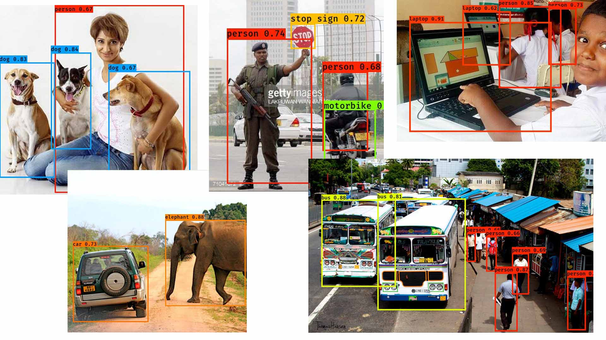
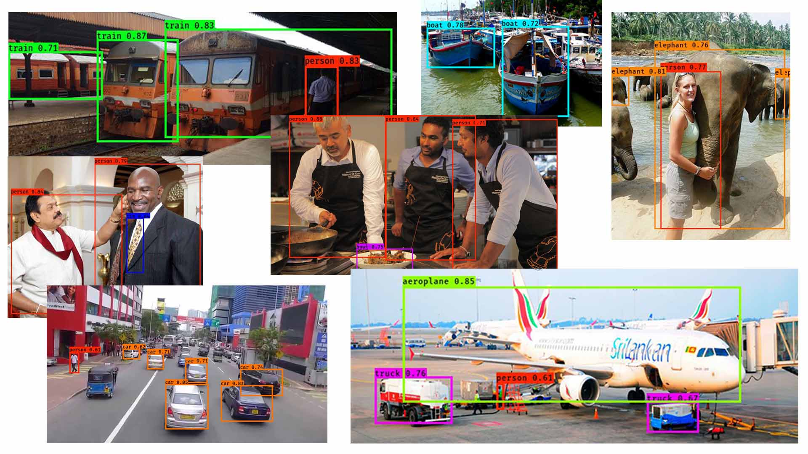

# YOLOv2 Object Detection w/ Keras (in just 20 lines of code)

This repository presents a quick and simple implementation of YOLOv2 object detection using Keras library with Tensorflow backend.
Credits goes to [YAD2K Library](https://github.com/allanzelener/YAD2K) on top of which this implementation was built. 

###### Note that I do not hold ownership to any of the above pictures. These are merely used for educational purposes to describe the concepts. 
--------------------------------------------------------------------------------
## Thoughts on the implementation

YOLO is well known technique used to perform fast multiple localizations on a single image.  

A brief algorithm breakdown;
- Divide the image using a grid (eg: 19x19)
- Perform image classification and Localization on each grid cell -> Result, a vector for each cell representing the probability of an object detected, the dimensions of the bounding box and class of the detected image.
- Perform thresholding to remove multiple detected instances 
- Perform Non-max suppression to refine the boxes more
- Additionally anchor boxes are used to detect several objects in one grid cell

###### If you want to dive down into how these above points are implemented in the code refer yolo_eval function in the keras_yolo.py file from the yad2k/models directory.

Paper reference: [YOLO9000: Better, Faster, Stronger](https://arxiv.org/abs/1612.08242) by Joseph Redmond and Ali Farhadi.

[Keras](https://keras.io/) is a high-level neural networks API, written in Python and capable of running on top of TensorFlow, CNTK, or Theano. It was developed with a focus on enabling fast experimentation. Being able to go from idea to result with the least possible delay is key to doing good research.

The use of keras helps to understand the concepts underling a ML technique by reducing the workload on coding. Thus, this implementation becomes a good platform for beginners to core concepts and have a quick implementation giving results. 

Also for anyone who is looking to integrate object detection capabilities in applications, this code can be incorperated with a few lines of code. 

Blog post on this: https://medium.com/@miranthaj/quick-implementation-of-yolo-v2-with-keras-ebf6eb40c684

--------------------------------------------------------------------------------

## Quick Start

- Clone this repository to your PC
- Download any Darknet model cfg and weights from the [official YOLO website](http://pjreddie.com/darknet/yolo/). 
- Convert the dowloaded cfg and weights files into a h5 file using YAD2K library. (This is explained step by step below in the more details section)
- Copy the generated h5 file to the model_data folder and edit the name of the pretrained model in yolo.py code to the name of your h5 file.
- Place the input image you want to try object detection in the images folder and copy its file name.
- Assign your input image file name to input_image_name variable in yolo.py.
- Open terminal from the repository directory directly and run the yolo.py file
	
	`python yolo.py`

--------------------------------------------------------------------------------

## More Details

How to convert cfg and weights files to h5 using YAD2k library (Windows)

- Clone the [YAD2K Library](https://github.com/allanzelener/YAD2K) to your PC
- Open terminal from the cloned directory
- Copy and paste the downloaded weights and cfg files to the YAD2K master directory
- Run `python yad2k.py yolo.cfg yolo.weights model_data/yolo.h5` on the terminal and the h5 file will be generated.
- Move the generated h5 file to model_data folder of the simpleYOLOwKeras directory

-------------------------------------------------------------------------------
